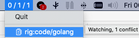

Mutagen Monitor for Mac
=======================

Description
-----------
[Mutagen Monitor](https://github.com/andrewmed/mutagenmon) is a system bar only Mac OS application made for monitoring active [Mutagen](https://mutagen.io) sessions

Ratio
-----
I have been using Mutagen for quite a lot for developing. For this purpose I use it only in 
[one-way-safe synchronization mode](https://mutagen.io/documentation/synchronization). I found Mutagen to be very convenient for syncing large monorepos because my main production environment is Linux and for editing I use Mac. We have clear separation between blobs (symlinks) and the code. Mutagen fit in nicely in a one-way-safe sync mode with 'ignore symlinks' flag.

The only thing I was missing was a GUI monitoring agent for Mac. That is why I made this

How to use
----------


In the bar there is a number of sessions in these states:
* healthy (connected and with no file conflict)
* connected (regardless of file conflicts)
* registered (regardless of file conflicts of connection state)
 
So on the picture we have one session, connected, but it has file conflicts. On mouse over you can see details for the session

How to build
------------
```
./build.sh
```

Alternatives
----------
[Mutagen Monitor](https://github.com/andrewmed/mutagenmon) was inspired by [MutagenMon](https://github.com/rualark/MutagenMon) thanks to @rualark! But that one seems to be aiming Windows plus there is a "python vs go" difference

This program is in Go and uses native api (mutagen is in Go too), as a result no new extra process is created while monitor is watching. This makes it possible to have less than 0.0% CPU usage when monitor is in background

FAQ
----
Q: I run Mutagen Monitor, but nothing happens, there is no menu in system bar

A: Check if Mutagen [daemon](https://mutagen.io/documentation/introduction/daemon) is running. To start daemon just type: `mutagen list` or `mutagen sync list` (on later versions)

Releases
--------
Signed releases for Mac are available at [releases](https://github.com/andrewmed/mutagenmon/releases)

Licence
-------
GPLv3