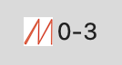

Mutagen Monitor for Mac
=======================

Description
-----------
[Mutagen Monitor](https://github.com/andrewmed/mutagenmon) is a system-bar-only Mac OSX application, made for monitoring active [Mutagen](https://mutagen.io) sessions

I have been using Mutagen actively for quite a lot for developing. For this purpouse I use it only in 
[one-way-safe synchronization mode](https://mutagen.io/documentation/synchronization).
I found Mutagen to be very convenient for syncing large monorepos because my main production environment is Linux and for editing I use Mac

The only thing I was missing was a monitoring agent for Mac. So I made this

How to use
----------


In the bar there is a number of sessions in these states:
* totally healthy (connected and with no file conflict)
* connected (regardless of file conflicts)
* registered (regardless of file conflicts of connection state)
 
So on the picture we have one session, connected, but it has file conflicts. On mouse over you can see details for the session

There is no interaction yet through the menu, except for Quit (see **todo** below for more)

How to build
------------
```
./build.sh
```

Alternatives
----------
This piece of software was inspired by [MutagenMon](https://github.com/rualark/MutagenMon) thanks to @rualark!
But that one seemed to be focused on Windows, and there is also "python vs go" difference.

This monitor is written in Go and uses native Mutagen api (it is written in Go also), so no process calls are made by the monitor.
This makes it possible to have less than 0.0% CPU usage when monitor is in background (on my machine)

MutagenMon by @rulark has more functionality however (conflict resolution feature is very nice).

Todo
----
* add conflict resolution (remove conflicting files on beta) on menu click (will work only for [one-way-safe synchronization mode](https://mutagen.io/documentation/synchronization))

Licence
-------
GPLv3